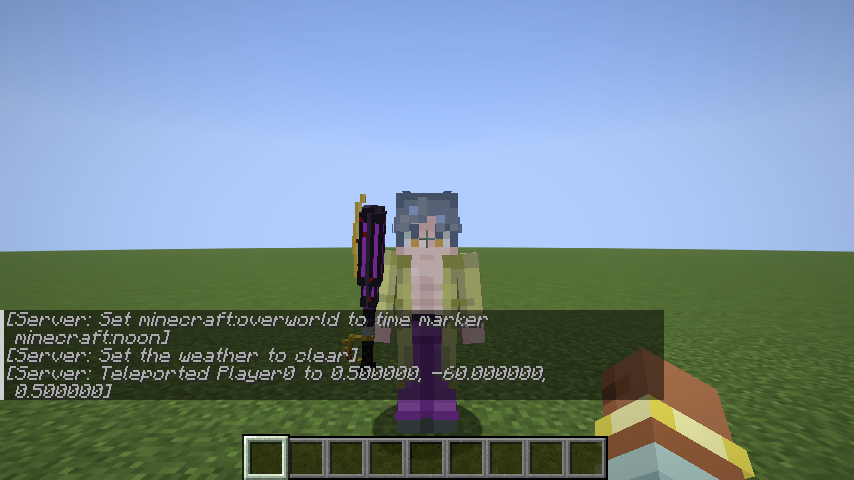
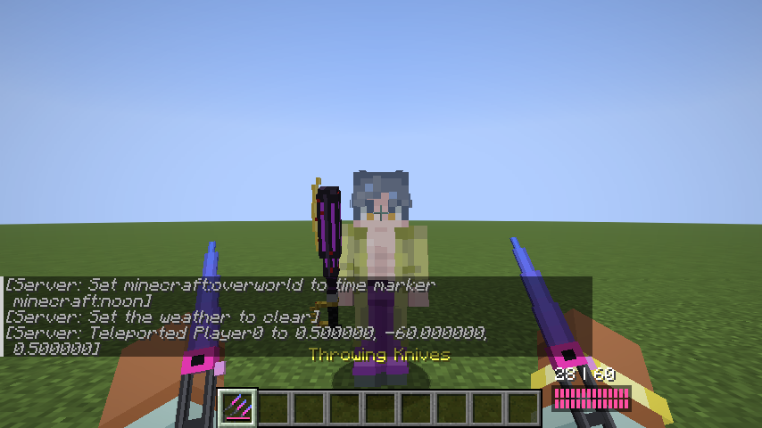
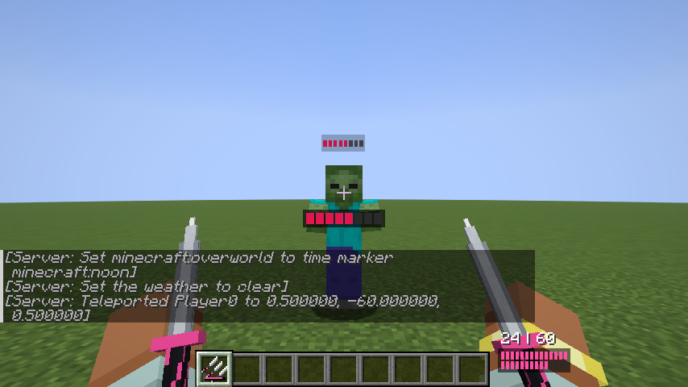
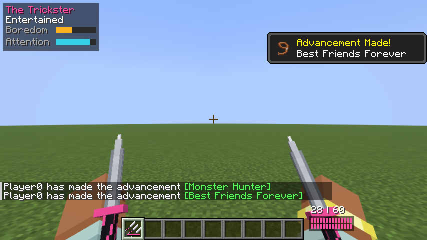
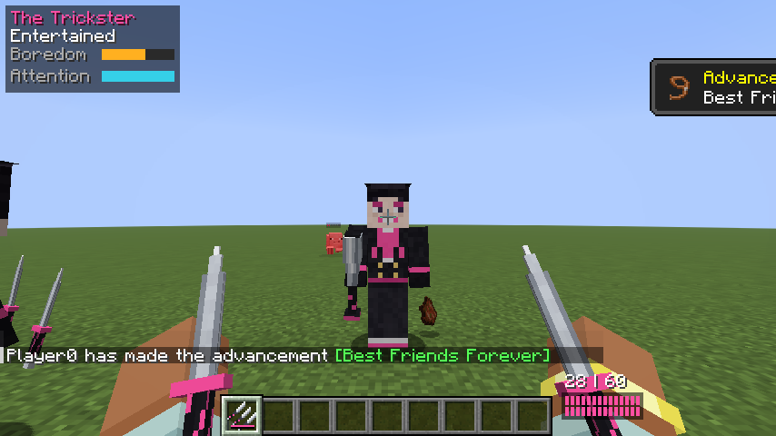
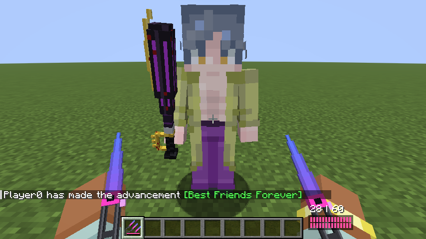
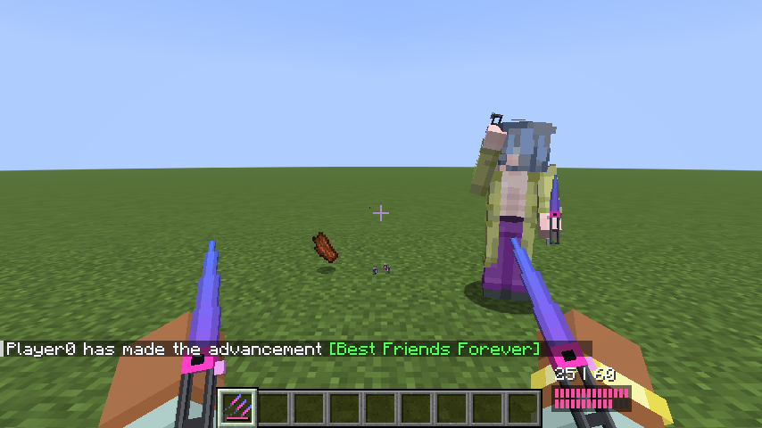
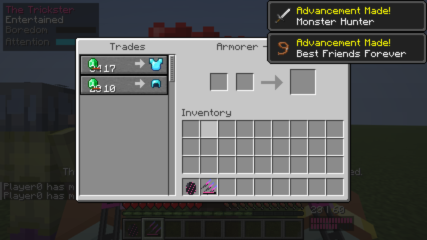
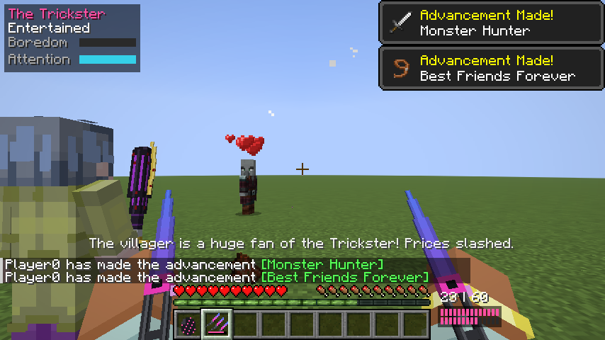
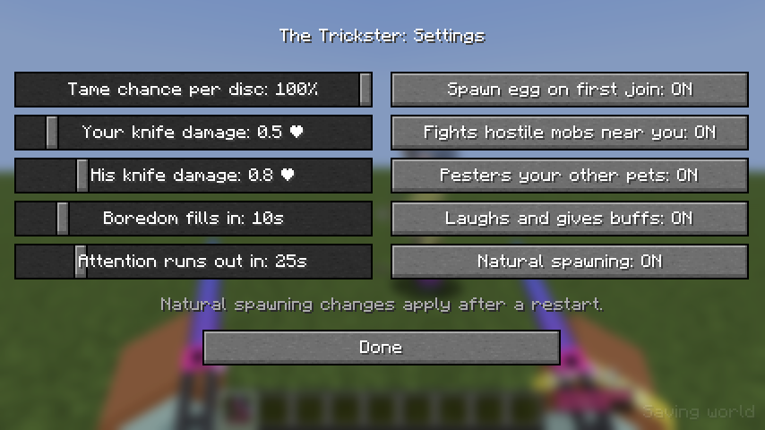

# The Trickster (Fabric 26.3)

Adds the Trickster from Dead by Daylight to Minecraft.

## Content

### The Trickster (mob)
- Uses the normal player model with a custom skin: `src/main/resources/assets/trickster/textures/entity/trickster.png`.
  To swap skins, replace that file with another 64x64 skin. The current skin uses slim (3px) arms; for a classic
  4px-arm skin set `SLIM_ARMS = false` in `TricksterRenderer.java`.
- Wild Tricksters spawn rarely at night and hunt players. He prefers knives: he keeps a few blocks away and throws
  8-knife volleys (exactly one full laceration meter), and only swings the Polished Head Smasher when something gets
  right up close.
- **Taming:** right click him with any music disc (the disc is used up). The chance is set in the config; it is 100%
  by default for testing. Once tamed he follows you, sits when you right click him, fights whatever you fight, and
  goes after hostile mobs that come within 16 blocks of you.
- **Boredom meter:** fills while you stand still doing nothing (no moving, swinging or using items). When full he
  throws knives at you for about 5 seconds. These knives are capped below the last laceration stack and never take you
  below half a heart, so they can't kill you. Right clicking him with a music disc (not used up) clears his boredom.
- **Attention meter:** drains while you aren't looking at him and refills while he's on your screen. At 0 he chases
  you and beats you with his bat until you look at him long enough to bring it back up to 40%.
- Both meters show in the top-left corner while your Trickster is within 32 blocks. They pause while he sits.
- **Personality:** every few minutes he picks one of your other pets and chases it around bonking it with his bat
  (it is always left with at least a heart). When he's happy and you've been paying attention to him he laughs and
  gives you a random 30-second buff. He also laughs when his knives finish something off.
- **Fans everywhere:** villagers are huge fans, so trades are 50% off while your tamed Trickster is within 16 blocks
  of the villager. Pillagers and the rest of a raid get starstruck the first time they see him and just stand there
  staring for 4 seconds instead of attacking. Both can be tuned or turned off in the settings.
- Every player gets a Trickster spawn egg the first time they join a world (can be turned off).

### Throwing Knives
- Recipe: iron ingot on top, iron / pink dye / iron in the middle, stick on the bottom.
- 28 knives per magazine; the pack starts with a full magazine plus 60 spare knives. No ammo crafting needed.
- Hold right click to throw; each knife alternates between your right and left hand in first person.
- When the magazine is empty, right click reloads from the spare knives (2 seconds).
- Knives that stick in the ground can be picked back up and go back into the spare pile.

### Third person
- Knife throws use an overhand throwing animation on the matching arm, for players and the Trickster.
- A player holding the knife pack shows a knife in each hand.

### Laceration
- Every knife hit adds one laceration stack. At 8 the target dies instantly (bypasses armor). Knife damage is kept
  low on purpose so weak mobs like pigs last long enough for the meter to fill.
- The meter shows above the head of anything that has been hit, under your crosshair when you look at it, and above
  your hotbar when you are the one being lacerated. Stacks drain one per second after 8 seconds without a hit.

### Sounds
Every sound picks a random file each time it plays, and each one can have as many files as you like.

| Sound | When it plays | Built-in |
| --- | --- | --- |
| `trickster.laugh` | buffs, pestering pets, finishing something off, sometimes when idle | 5 laugh recordings |
| `trickster.idle` | random noises while he hangs around | vanilla placeholder |
| `trickster.annoyed` | he gets bored, feels ignored, or refuses a disc | vanilla placeholder |
| `laceration.warning` | one knife away from a full meter | vanilla placeholder |
| `laceration.max` | the meter fills | vanilla placeholder |
| `knife.throw` | a knife is thrown | vanilla placeholder |
| `knife.hit_flesh` | a knife hits a mob or player | vanilla placeholder |
| `knife.hit_block` | a knife hits a block or something that isn't alive (boats, armor stands) | vanilla placeholder |
| `knife.reload` | the knife pack reloads | vanilla placeholder |
| `knife.draw` | knives are pulled out (switching to the pack, or him swapping from bat to knives) | vanilla placeholder |

The knife sounds are shared by the Throwing Knives item and the Trickster's own knives.

**Changing sounds in game:** each sound has a folder in `config/trickster/sounds/` (the "Open sounds folder" button in
the settings screen takes you there). Drop `.ogg` files into a folder (any file names, mono for positional audio),
then press "Reload sounds" or F3+T. By default your files replace the built-in ones for that sound; turn off "Custom
sounds replace built-in" to play them alongside the built-in ones.

**Changing the built-in sounds:** the defaults live in `src/main/resources/assets/trickster/sounds/` and are listed in
`assets/trickster/sounds.json`. A normal resource pack can override them too.

### Polished Head Smasher
- A heavy bat with extra knockback. Dropped by the Trickster (35%) or crafted.

## Settings

Open the settings screen with **O** (rebindable under Controls), or from the Config button in Mod Menu if you have it.
Everything is saved to `config/trickster.json`:

| Setting | Default |
| --- | --- |
| Tame chance per disc | 100% |
| Your knife damage | 0.5 hearts |
| His knife damage | 0.75 hearts |
| Boredom fills in | 10 s |
| Attention runs out in | 25 s |
| Spawn egg on first join | on |
| Fights hostile mobs near you | on |
| Pesters your other pets | on |
| Laughs and gives buffs | on |
| Natural spawning (restart needed) | on |
| Villager fan discounts | on, 50% off |
| Starstruck raiders | on, 4 s |
| Custom sounds replace built-in | on |

## Building

Requires Java 25.

```
./gradlew build
```

The mod jar ends up in `build/libs/`.

`./gradlew runClientGameTest` boots a test world and saves screenshots of the mod's visuals to
`build/run/clientGameTest/screenshots`.

## Screenshots

Taken by the headless game test.











